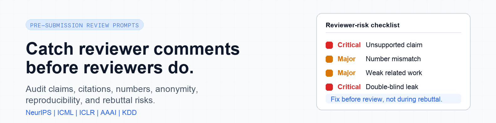

<div align="center">



# 🔍 AI-paper-reviewer

**在 reviewer 发现问题之前，先自己发现。**

面向 NeurIPS、ICML、ICLR、AAAI、KDD 等顶会投稿场景的严格论文自审 prompt 工具箱。它帮助你在投稿前检查逻辑、claim、实验、引用、双盲匿名、可复现性和 rebuttal 风险。

[](LICENSE)
[](CONTRIBUTING.md)
[](#)

🇨🇳 中文 · [🇬🇧 English](README_EN.md)

</div>

---

> 很多拒稿痛点并不是一个致命错误,而是一串本来可以提前修掉的问题:claim 过强、定位不清、数字不一致、引用缺失、写作含糊、双盲泄露。

## 它帮你提前抓什么

- 证据支撑不了的过强 claim
- reviewer 容易挑战的 `significant`、`novel`、`state-of-the-art`
- 引用缺口、相关工作定位不足、疑似幻觉引用
- Abstract / Table / Figure 里的数字不一致
- 投稿前的 reproducibility checklist 风险
- 正文、链接、metadata、acknowledgments 里的双盲泄露
- 本可以在 rebuttal 前就修掉的问题

## 这个项目是什么

AI-paper-reviewer 是一组可直接复制到 Claude / ChatGPT / Gemini / Codex 的 paper review prompts。它综合 **NeurIPS / ICML / ICLR / AAAI / KDD 多届顶会 reviewer guidelines、OpenReview 公开讨论以及作者本人的投稿与 rebuttal 经验**,整理成一套可复用的投稿前自审流程。

它不是帮你“包装”论文,而是帮你用 reviewer 的视角提前发现论文中最容易被扣分的地方。

---

## ✨ 核心特色

- 🎯 **10 维度审查框架** — 逻辑 / 实证 / 写作 / 引用 / 数学符号 / 双盲 / 格式 / 语言 / 结构 / 红旗
- 🚨 **4 级红旗体系** — 🔴 Critical / 🟠 Major / 🟡 Minor / 🟢 Pass,**优先级清晰**
- 📊 **段落级精细审查** — 每段给 10 维度评分 + 逐句改写建议
- 🔁 **全局问题追踪** — `redefine` 类 claim、`state-of-the-art` 频次、符号一致性**贯穿全篇**
- 🤝 **顶会风格 native** — IEEE / ACM / NeurIPS / ICLR 标准
- 📋 **可复现性 checklist 助手** — 帮你 1 分钟填好 21 项 NeurIPS / ICML reproducibility 问卷
- 🛡️ **双盲合规扫描** — 自动检测真名 / 邮箱 / 学校 / 路径 / metadata 残留

---

## 🚀 3 分钟开始自审

```
1. 打开你的 AI 对话(Claude / ChatGPT / Gemini 都行)
2. 复制 prompts/02_paragraph_audit.md 整块到对话框
3. AI 回复 "准备好了"
4. 按段落贴 paper 内容,拿到严格审查 + 可直接替换的改写建议
```

最常用的是 [`02_paragraph_audit.md`](prompts/02_paragraph_audit.md):适合在改稿时一段一段过,持续追踪 claim、citation、notation、numbers 和 reviewer red flags。

---

## 📑 目录

### Part I: 核心审稿工作流

| 文件 | 用途 | 使用场景 |
|---|---|---|
| [`00_master_workflow.md`](prompts/00_master_workflow.md) | 完整 10 维度审稿工作流 | **主入口** |
| [`01_full_paper_audit.md`](prompts/01_full_paper_audit.md) | 整篇 paper 审查 | 大 milestone 用 |
| [`02_paragraph_audit.md`](prompts/02_paragraph_audit.md) ⭐ | 单段精细审查 + 全局追踪 | **最高频** |

### Part II: 章节专项

| 文件 | 用途 |
|---|---|
| [`03_abstract_polish.md`](prompts/03_abstract_polish.md) | Abstract 专项审查 |
| [`04_intro_polish.md`](prompts/04_intro_polish.md) | Introduction 专项(砍 cite + 去 puffery) |
| [`05_method_polish.md`](prompts/05_method_polish.md) | Methodology 专项(符号 + 算法描述) |
| [`06_experiments_check.md`](prompts/06_experiments_check.md) | Experiments + Table 数字一致性 |
| [`07_conclusion_polish.md`](prompts/07_conclusion_polish.md) | Conclusion 专项(去 marketing tone) |

### Part III: 专项 Check

| 文件 | 用途 |
|---|---|
| [`08_double_blind_check.md`](prompts/08_double_blind_check.md) | 🛡️ 双盲合规扫描(姓名 / 路径 / metadata) |
| [`09_citation_ieee_format.md`](prompts/09_citation_ieee_format.md) | BibTeX → IEEE bibitem 转换 |
| [`10_math_notation_check.md`](prompts/10_math_notation_check.md) | τ / θ / σ / ρ 符号一致性 |
| [`11_anti_AI_smell.md`](prompts/11_anti_AI_smell.md) | 去 "AI 味"(机翻痕迹 / 模板腔) |

### Part IV: 投稿前后

| 文件 | 用途 |
|---|---|
| [`12_reviewer_response.md`](prompts/12_reviewer_response.md) | Rebuttal / Response to reviewer 起草 |
| [`13_repro_checklist.md`](prompts/13_repro_checklist.md) | 21 项 NeurIPS Reproducibility Yes/No/NA 助手 |

### Part V: 红旗速查

| 文件 | 用途 |
|---|---|
| [`14_reviewer_red_flags.md`](prompts/14_reviewer_red_flags.md) | 顶会 reviewer 红旗速查表(随时翻) |

---

## 📊 实战效果

### 真实案例:Abstract 改前 / 改后

[`examples/case_01_abstract_before_after.md`](examples/case_01_abstract_before_after.md)
关键修改 9 处:`we are the first` → `we recast`、`significantly outperforms` → 具体数字、`world's largest by volume` → 删除等。

### 真实案例:Methodology 符号一致性修复

[`examples/case_02_method_audit.md`](examples/case_02_method_audit.md)
Algorithm 描述里 `θ` 跟 `τ` 同时出现导致内部矛盾的修复全过程。

---

## 📚 支持文档

- [`docs/10_dimensions_explained.md`](docs/10_dimensions_explained.md) — 10 维度框架详解
- [`docs/severity_tiers.md`](docs/severity_tiers.md) — 4 级红旗体系详解
- [`docs/usage_guide.md`](docs/usage_guide.md) — 进阶使用指南(跨段对照 / token 优化 / 自动化 pipeline 等)

---

## 🎓 10 维度审查框架

| 维度 | 核心问题 |
|---|---|
| **[A] 逻辑 & 论证** | 前提 → 结论是否成立?反例考虑了吗? |
| **[B] 实证严谨性** | 数字 cross-table 一致?baseline 公平?`significantly` 有 p-value? |
| **[C] 写作质量** | 指代歧义?被动语态滥用?时态一致? |
| **[D] 引用 & 归属** | 每个 claim 有 cite?自引用第三人称? |
| **[E] 数学符号** | 同一符号在不同位置代表不同含义? |
| **[F] 双盲匿名性** | "we" 之外的身份暗示?metadata 已清空? |
| **[G] 格式 / IEEE** | citation 标题 sentence case?表格小数点对齐? |
| **[H] 语言纯净度** | 中文字符 / emoji / 双语并置残留? |
| **[I] 结构 & 衔接** | topic sentence?transition?Figure / Table 在 ref 后被解读? |
| **[J] Reviewer 红旗** | `we are the first` / `no matter how complex` / `obviously` 等危险词? |

详见 [`docs/10_dimensions_explained.md`](docs/10_dimensions_explained.md)。

---

## 🚨 4 级红旗体系

| 等级 | 含义 | 处理 |
|---|---|---|
| 🔴 **Critical** | reviewer 直接拒 / desk reject 风险 | **必须改** |
| 🟠 **Major** | reviewer 主要扣分点 | **强烈建议改** |
| 🟡 **Minor** | reviewer 提 minor comment | **力推改** |
| 🟢 **Pass** | 完全通过 | — |

详见 [`docs/severity_tiers.md`](docs/severity_tiers.md)。

---

## 🤝 贡献

发现新的 reviewer 红旗?碰到没覆盖的场景?欢迎 PR。详见 [`CONTRIBUTING.md`](CONTRIBUTING.md)。

---

## 🌟 Star History

如果这个项目帮你避免了一次 reviewer 退稿,**点个 Star 让更多人看到** ⭐

---

## 📄 License

[MIT](LICENSE) — 可自由商用、修改、分发,需保留版权与许可声明
